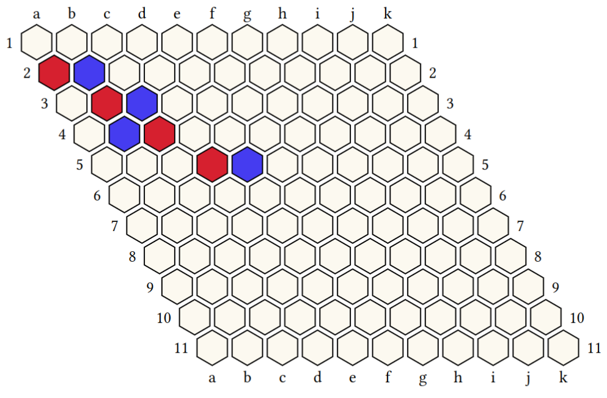

## TypHex

TypHex is a small package to draw [hex board game](https://en.wikipedia.org/wiki/Hex_(board_game))'s grids in [Typst](https://typst.app/).

Currently, it only implement some function to draw hexagons and make a grid of them, and a basic [SGF (smart game format)](https://en.wikipedia.org/wiki/Smart_Game_Format) tokenizer / parser.

This allows the user to simply call `gridFromSGF` implemented in `TypHex.typ` with as parameter a SGF string (generated with [HexGUI](https://github.com/ryanbhayward/hexgui) or any other software with similar SGF generated) to draw the game grid.

### Exemple :
When executing `gridFromSGF("(;FF[4]SZ[11];AB[a1][b2][c3][d4]AW[b1][c2][b3][e4]PL[W])")` :

